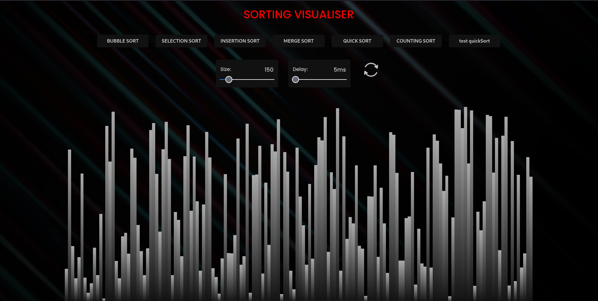

# Sorting Algorithm Visualiser
This project implements visualisation for sorting algorithms

### A glimpse at the work 


### merge sort in action


### quick sort in action


## Algorithms Implemented
### Bubble sort
  ```js
  const bubbleSort = (arr) => {
    for (let i = 0; i < arr.length; i++) {
      for (let j = 0; j < arr.length - i - 1; j++) {
        if (arr[j] > arr[j + 1]) {
          [arr[j], arr[j + 1]] = [arr[j + 1], arr[j]];
        }
      }
   };

  ```
### Selection sort
  ```js
  const selectionSort = (arr) => {
    for (let i = 0; i < arr.length; i++) {
      let min_idx = i;
      for (let j = i + 1; j < arr.length; j++) {
        if (arr[j] < arr[min_idx]) {
          [arr[j], arr[min_idx]] = [arr[min_idx], arr[j]];
        }
      }
    }
  };

  ```
### Insertion sort
  ```js
  const insertionSort = (arr) => {
    for (let i = 1; i < size; i++) {
      let key = arr[i];
      let j = i - 1;

      while (j >= 0 && arr[j] > key) {
        arr[j + 1] = arr[j];
        j--;
      }
      arr[j + 1] = key;
    }
  };

  ```
### Merge sort
  ```js
  const mergeSort = (arr, l, r) => {
    if (l >= r) {
      return;
    }

    let m = Math.floor((l + r) / 2);
    mergeSort(arr, l, m);
    mergeSort(arr, m + 1, r);
    const dupArr = arr.slice();
    merge(dupArr, arr, l, m, r);
  };

  const merge = (dupArr, arr, l, m, r) => {
    let i = l;
    let j = m + 1;
    let k = l;
  
     while (i <= m && j <= r) {
       if (dupArr[i] <= dupArr[j]) {
         arr[k++] = dupArr[i++];
       } else {
         arr[k++] = dupArr[j++];
       }
     }
     while (i <= m) {
       arr[k++] = dupArr[i++];
     }
     while (j <= r) {
       arr[k++] = dupArr[j++];
     }
  };
  ```
### Quick sort - random pivot
  ```js
  const quickSort = (arr, start, end) => {
    const p = Partition(arr, start, end);
    if (p - 1 > start) quickSort(arr, start, p - 1);
    if (p + 1 < end) quickSort(arr, p + 1, end);
  };

  const Partition = (arr, start, end) => {
    let randidx = Math.floor(Math.random() * (end - start + 1)) + start;
    [arr[end], arr[randidx]] = [arr[randidx], arr[end]];

    let pivot = arr[end];
    let j = start - 1;

    for (let i = start; i < end; i++) {
      if (arr[i] < pivot) {
        j++;
        [arr[i], arr[j]] = [arr[j], arr[i]];
      }
    }

    [arr[j + 1], arr[end]] = [arr[end], arr[j + 1]];
    return j + 1;
  };

  ```
### Counting sort
  ```js
  const countingSort = (arr, min, max) => {
    let i = 1;
    let j = 0;
    let count = Array(max - min + 1).fill(0);

    for (i = 0; i < arr.length; i++) {
      count[arr[i]] += 1;
    }

    for (i = min; i <= max; i++) {
      while (count[i] > 0) {
        arr[j] = i;
        j++;
        count[i]--;
      }
    }
    return arr;
  };

  ```
